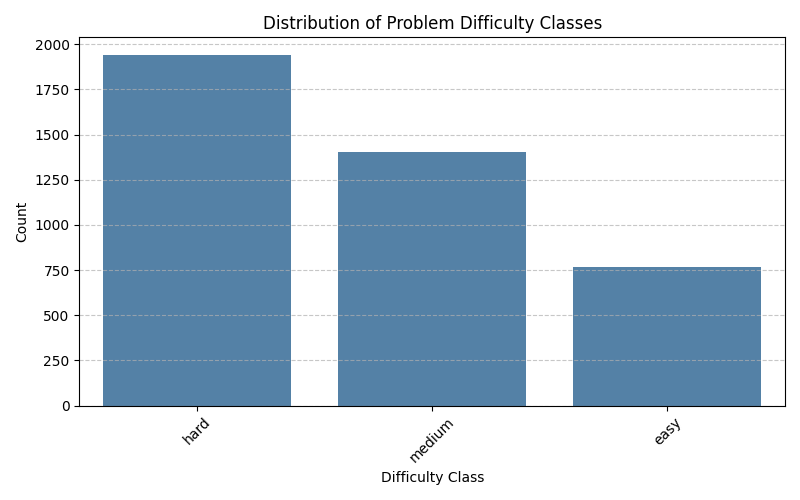
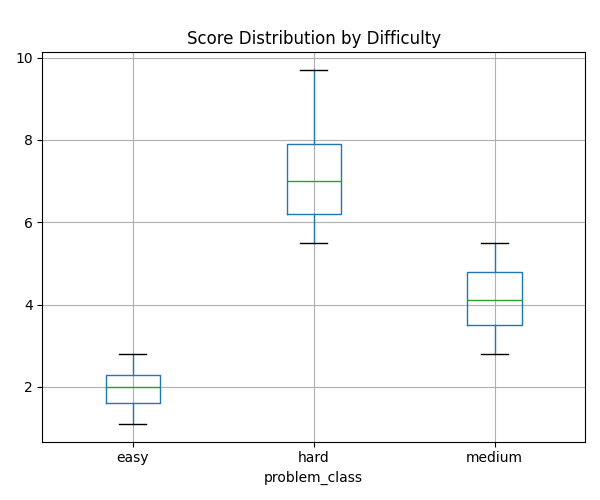
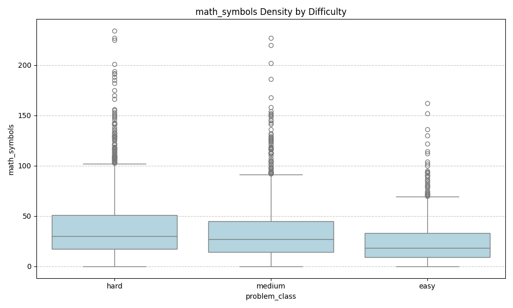
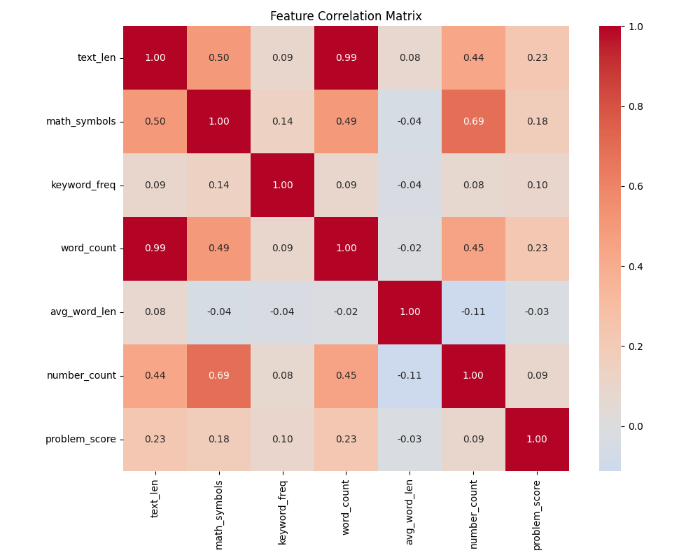
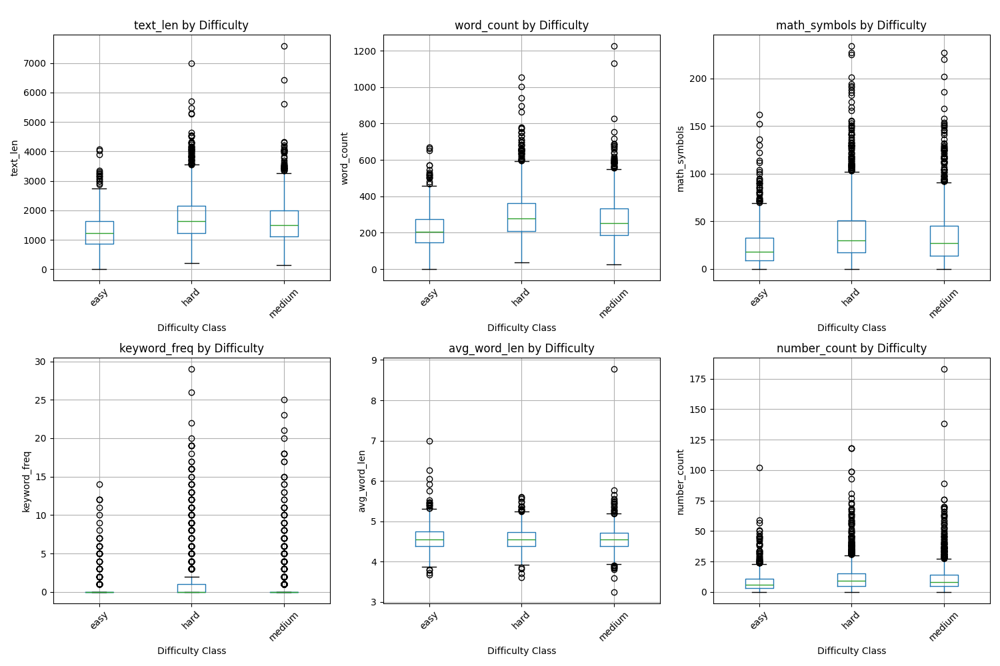
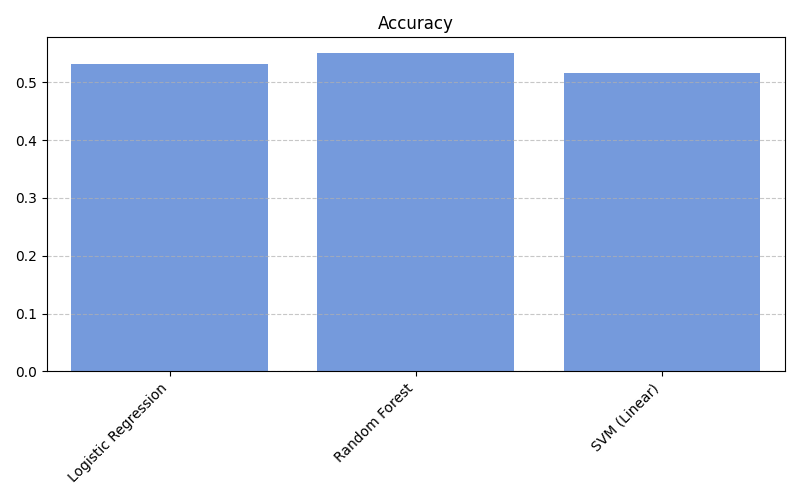
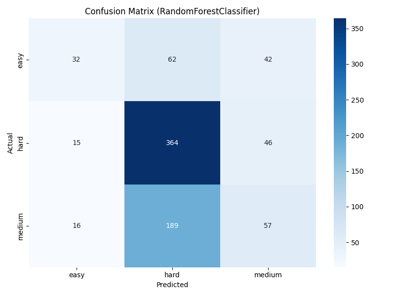
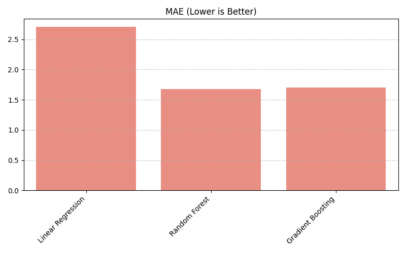
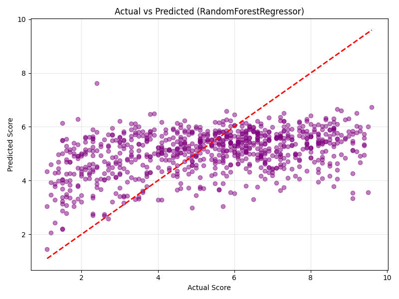

# AutoJudge: AI-Based Difficulty Estimator for Coding Problems


**AutoJudge** is an intelligent predictive tool built to assign difficulty ratings to programming challenges automatically. By processing the raw text of a problem statement, the system evaluates linguistic complexity, mathematical density, and domain-specific terminology to output a **Difficulty Class** (Easy, Medium, or Hard) and a precise **Numerical Score**.

The goal of this tool is to provide a standardized, objective metric for grading coding problems, replacing manual human categorization.

---

## 📑 Contents
1.  [System Overview](#-system-overview)
2.  [Project Demo](#-project-demo)
3.  [Data Analysis](#-data-analysis)
4.  [Feature Extraction](#-feature-extraction)
5.  [Algorithm Benchmarking](#-algorithm-benchmarking)
6.  [Performance Metrics](#-performance-metrics)
7.  [Application Interface](#-application-interface)
8.  [Setup Guide](#-setup-guide)
9.  [Repository Map](#-repository-map)

---

## 🔭 System Overview

Competitive programming platforms often struggle with inconsistent difficulty tags. AutoJudge addresses this by deploying a robust **Natural Language Processing (NLP)** pipeline.

**Core Workflow:**
1.  **Data Ingestion:** The system accepts full problem details including Title, Description, and I/O formats.
2.  **Metadata Extraction:** It scans for indicators of complexity, such as heavy mathematical notation or complex constraints.
3.  **Inference:** A trained Random Forest Ensemble predicts the final difficulty rating.

---

## 🎥 Project Demo

> **https://youtu.be/d7fPljQl7Ss**
>
> *Duration: 2-3 Minutes*
> *A walkthrough covering the model architecture, training process, and live UI demo.*

---

## 📊 Data Analysis

I utilized a dataset of **4,112 competitive programming problems** to train the models.

### Class Balance
The training corpus shows an imbalance towards harder problems, which mirrors real-world competitive programming environments:
*   🔴 **Hard:** 1,941 instances
*   🟠 **Medium:** 1,405 instances
*   🟢 **Easy:** 766 instances

<p align="center">
  
  <br>
  <em>Figure 1: Breakdown of the dataset by difficulty category.</em>
</p>

### Score Statistics
Numerical scores were analyzed for distribution patterns. To handle missing data points without introducing bias, I applied median imputation (**5.2**).

<p align="center">
  
  <br>
  <em>Figure 2: Statistical spread of difficulty scores across the dataset.</em>
</p>

---

## 🧠 Feature Extraction

I engineered a **Dual-Layer Feature Set** to maximize predictive power. This combines semantic understanding with structural analysis.

### engineered Meta-Features
I wrote custom logic to extract 6 specific signals from the text:
*   **Math Symbol Density:** The frequency of LaTeX symbols (e.g., `$`, `\sum`, `^`) often indicates higher difficulty.
*   **Keyword Heuristics:** Detection of terms like "Dynamic Programming", "Tree", or "Recursion".
*   **Structural Metrics:** Text length, total word count, average word length, and the count of numeric constants.

<p align="center">
  
  <br>
  <em>Figure 3: Correlation between Math Symbol count and Problem Class.</em>
</p>

<p align="center">
  
  <br>
  <em>Figure 4: Heatmap displaying relationships between engineered features and the target score.</em>
</p>

<p align="center">
  
  <br>
  <em>Figure 5: Comprehensive view of all 6 meta-features across difficulty levels.</em>
</p>

---

## ⚙️ Algorithm Benchmarking

To determine the optimal architecture, I established a **Model Battle Framework**. The data was partitioned into an **80% Training Set** and a **20% Test Set** for validation.

### Classification Candidates
1.  **Logistic Regression:** Standard linear approach.
2.  **Linear SVC:** Support Vector Machine optimized for high-dimensional text data.
3.  **Random Forest Classifier:** A bagging ensemble method using decision trees.

### Regression Candidates
1.  **Linear Regression:** Baseline estimator.
2.  **Gradient Boosting:** Boosting ensemble for error minimization.
3.  **Random Forest Regressor:** Non-linear bagging ensemble.

---

## 🧪 Performance Metrics

Following rigorous testing, the **Random Forest** architecture proved to be the most reliable for both tasks, outperforming linear models in capturing complex feature interactions.

### Classification Accuracy
| Model | Accuracy | Verdict |
| :--- | :--- | :--- |
| **Random Forest** | **55.04%** | ✅ **Winner** |
| Logistic Regression | 51.64% | Eliminated |
| Linear SVC | 50.55% | Eliminated |

<p align="center">
  
  <br>
  <em>Figure 6: Comparative accuracy of classification algorithms.</em>
</p>

<p align="center">
  
  <br>
  <em>Figure 7: Confusion Matrix for the selected Random Forest model.</em>
</p>

### Regression Error (MAE)
| Model | MAE (Error) | RMSE | Verdict |
| :--- | :--- | :--- | :--- |
| **Random Forest** | **1.68** | **2.02** | ✅ **Winner** |
| Gradient Boosting | 1.70 | 2.04 | Eliminated |
| Linear Regression | 2.70 | 3.37 | Eliminated |

<p align="center">
  
  <br>
  <em>Figure 8: Mean Absolute Error comparison (Lower is better).</em>
</p>

<p align="center">
  
  <br>
  <em>Figure 9: Scatter plot of Predicted vs Actual Scores.</em>
</p>

---

## 💻 Application Interface

The system is fronted by a **Streamlit Web Dashboard** designed with a "Cosmic Glass" aesthetic.

**Capabilities:**
*   **Instant Analysis:** Users can input raw text and get results in milliseconds.
*   **Transparent Reporting:** The UI displays the predicted Difficulty Class, the specific Score, and a breakdown of the detected features (like Math Density).
*   **Code Reusability:** The frontend imports logic directly from the `src/` backend package, ensuring the inference pipeline matches the training pipeline exactly.

---

## 🛠️ Setup Guide

**Requirements:** Python 3.8 or newer.

### 1. Get the Code
```bash
git clone https://github.com/YOUR_USERNAME/AutoJudge.git
cd AutoJudge
```

### 2. Install Libraries
```bash
pip install -r requirements.txt
```

### 3. Training (Optional)
To execute the full data pipeline and regenerate the analysis graphs:
```bash
python main.py
```

### 4. Start the Dashboard
```bash
streamlit run app.py
```

---

## 📂 Repository Map

The project is organized into a modular, production-ready structure:

```text
AutoJudge/
├── app.py                 # User Interface (Streamlit)
├── main.py                # Training Execution Script
├── requirements.txt       # Dependencies
├── src/                   # Core Logic Package
│   ├── __init__.py
│   ├── features.py        # Logic: Meta-feature extraction
│   ├── preprocessing.py   # Logic: Text cleaning
│   ├── plotting.py        # Logic: Graph plotting
│   ├── classification.py  # Logic: Classifier training
│   ├── regression.py      # Logic: Regressor training
│   ├── eda.py             # Logic: Data Analysis
│   ├── train.py           # Logic: Pipeline Orchestrator
│   └── utils.py           # Logic: Config & Logging
├── data/                  # Source Data
├── models/                # Trained .pkl Files
└── reports/               # Evaluation Graphs & Logs
```

---
